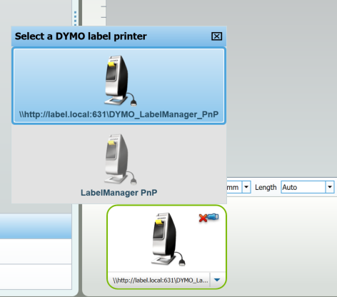

Software installation
=====================

We will assume, that you start with a fresh Raspbian installation on a Raspberry Pi Zero W.

I'm using an mDNS domain `label.local` to refer to the Pi. Replace it with the IP or mDNS of yours.


Prerequirements
---

```bash
sudo apt update
sudo apt install -y git
```

Commandline tool setup (required)
----------------------------

[comment]: # (Change to Python3 when demoprint is updated)

First, install dymoprint, the default font, give users access to the device and enable printer mode.
```bash
sudo apt-get install fonts-roboto-hinted python-pillow
git clone https://github.com/matrach/dymoprint
cd dymoprint/
sudo cp 91-dymo-labelmanager-pnp.rules /etc/udev/rules.d/
sudo cp dymo-labelmanager-pnp.conf /etc/usb_modeswitch.d/
sudo service udev reload
```

Now, plug the label printer, wait a few seconds and print a test label:
```bash
./dymoprint test
```

If you got a label, there probably would be no further issues with the printer. Continue to the next step after:
```bash
cd ..
```


Cups for remote printing
-------------------------

This will allow printing from DymoLabel for Windows/Mac or gLabels for Linux. This section is based upon
[great work by Craig L](https://chicagodist.com/blogs/news/15272985-using-the-raspberry-pi-as-a-print-server-for-a-dymo-4xl-label-printer).

Start with installing minimal cups setup:
```bash
sudo apt install --no-install-recommends cups
```

Then, get the drivers package:
```bash
sudo apt install printer-driver-dymo
```

If, for any reason, those drivers would not work,[download the SDK](http://download.dymo.com/dymo/Software/Download%20Drivers/Linux/Download/dymo-cups-drivers-1.4.0.tar.gz) from [Dymo site](http://www.dymo.com/en-US/dymo-label-sdk-and-cups-drivers-for-linux-dymo-label-sdk-cups-linux-p--1#) and follow steps described [there](https://chicagodist.com/blogs/news/15272985-using-the-raspberry-pi-as-a-print-server-for-a-dymo-4xl-label-printer).

[comment]: # (Don't hotlink to dymo's, it's GPL so we can redistribute)
```bash
wget http://download.dymo.com/dymo/Software/Download%20Drivers/Linux/Download/dymo-cups-drivers-1.4.0.tar.gz

```

Grant the `pi` user rights to configure Cups and enable remote administration and printer sharing:
```bash
sudo adduser pi lpadmin
sudo cupsctl --remote-admin --remote-any --share-printers
sudo service cups restart

```

Now you can configure sharing of the printer through the web interface located at`https://label.local:631/admin`.
Make sure to check the box for "Share this printer" ([step-by-step guide](https://chicagodist.com/blogs/news/15272985-using-the-raspberry-pi-as-a-print-server-for-a-dymo-4xl-label-printer)).

If you kept the default names, the url of the printer is:
`http://label.local:631/printers/DYMO_LabelManager_PnP`.
You can add it as a remote printer.
If you're using Windows on one of your machines, [this tutorial might come useful](https://zedt.eu/tech/windows/installing-an-ipp-printer-in-windows-10/).
In DYMO Label software it would be visible like this, with *disconnected* indicator:



Web service
-----------
[comment]: # (Remember, that udev might not be set up)

**TODO**
We're going to install python packages from the Raspbian repository, as it is simpler to manage security updates on
a single-purpose device.

```bash
sudo apt install fontconfig
sudo apt install python3-flask python3-flask-babel python3-fontconfig
```